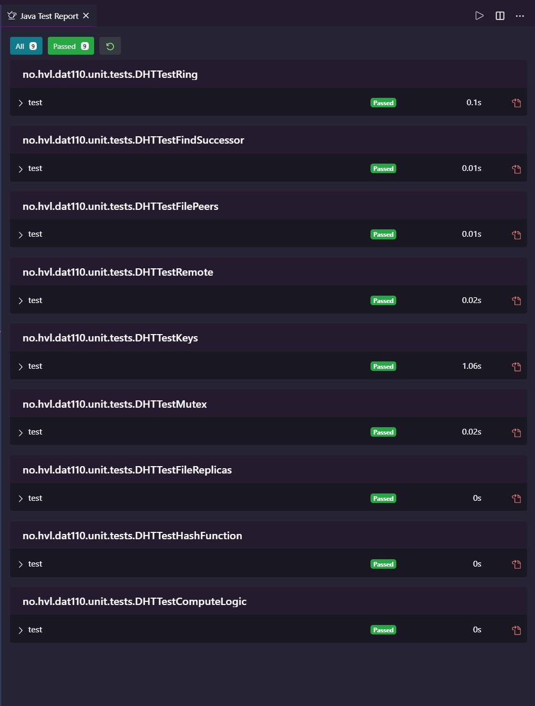

<h1 align="center">DAT110 Project 3</h1>

  

  

  

  

  <!--  -->

  <!--  -->

  <!--  -->

  <a href="#dart-about">About</a> &#xa0; | &#xa0; 
  <a href="#white_check_mark-requirements">Unit tests</a> &#xa0; | &#xa0;
  <a href="https://github.com/orgs/Gruppe10-HVL" target="_blank">Author</a>

 

## :dart: About

Finished code for DAT110 Project 3, Spring 2021

## :white_check_mark: Unit tests

Written/finished by <a href="https://github.com/orgs/Gruppe10-HVL" target="_blank">Gruppe 10</a>

&#xa0;

<a href="#top">Back to top</a>
